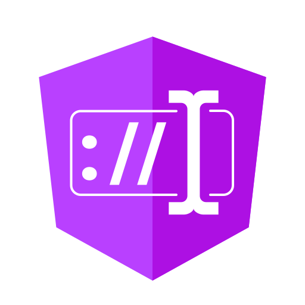

<h1 align="center">
  @ngneat/input-mask
</h1>

<p align="center">
  
</p>

<br />

[](https://www.npmjs.com/package/@ngneat/input-mask)
[](https://github.com/ngneat/input-mask/blob/main/LICENSE)
[]()
[](https://github.com/ngneat/input-mask/pulls)
[](https://github.com/prettier/prettier)
[](#contributors-)
[](https://github.com/ngneat/lib)
[]()
[](https://github.com/semantic-release/semantic-release)

> @ngneat/input-mask is an angular library that creates an input mask. Behind the scene, it uses [inputmask](https://github.com/RobinHerbots/Inputmask).

## Features

- 🔡  **Support for form validation**
- 🎭  **Wrapper function to easily create input-masks**
- 🔁  **Helps you to convert final values to desired format**
- ☝️  **Single directive to handle everything**
- 🛠  **All the configurations of [inputmask](https://github.com/RobinHerbots/Inputmask) provided**

## Installation

You can install it through **Angular CLI**

```
ng add @ngneat/input-mask
```

or with **npm**

```
npm install @ngneat/input-mask inputmask@5
npm install -D @types/inputmask@5
```

When you install using **npm** or **yarn**, you will also need to import `InputMaskModule` in your `app.module`:

```typescript
import { InputMaskModule } from '@ngneat/input-mask';

@NgModule({
  imports: [InputMaskModule],
})
class AppModule {}
```

## Usage examples

### 1. Date


```typescript
import { Component } from '@angular/core';
import { FormControl } from '@angular/forms';
import { createMask } from '@ngneat/input-mask';

@Component({
  selector: 'app-root',
  template: `
    <input [inputMask]="dateInputMask" [formControl]="dateFC" placeholder="dd/mm/yyyy">
  `,
})
export class AppComponent {
  dateInputMask = createMask<Date>({
    alias: 'datetime',
    inputFormat: 'dd/mm/yyyy',
    parser: (value: string) => {
      const values = value.split('/');
      const year = +values[2];
      const month = +values[1] - 1;
      const date = +values[0];
      return new Date(year, month, date);
    },
  });

  dateFC = new FormControl('');
}
```

### 2. IP Address


```typescript
@Component({
  template: `
    <input [inputMask]="ipAddressMask" [formControl]="ipFC" placeholder="_._._._">
  `,
})
export class AppComponent {
  ipAddressMask = createMask({ alias: 'ip' });
  ipFC = new FormControl('');
}
```

### 3. Currency


```typescript
@Component({
  template: `
    <input [inputMask]="currencyInputMask" [formControl]="currencyFC" placeholder="$ 0.00">
  `,
})
export class AppComponent {
  currencyInputMask = createMask({
    alias: 'numeric',
    groupSeparator: ',',
    digits: 2,
    digitsOptional: false,
    prefix: '$ ',
    placeholder: '0',
  });
  currencyFC = new FormControl('');
}
```

### 4. License Plate


```typescript
@Component({
  template: `
    <input [inputMask]="licenseInputMask" [formControl]="licenseFC" placeholder="___-___">
  `,
})
export class AppComponent {
  licenseInputMask = createMask('[9-]AAA-999');
  licenseFC = new FormControl('');
}
```

### 5. Email


```typescript
@Component({
  template: `
    <input [inputMask]="emailInputMask" [formControl]="emailFC" placeholder="_@_._">
  `,
})
export class AppComponent {
  emailInputMask = createMask({ alias: 'email'});
  emailFC = new FormControl('');
}
```

### More examples

All examples are available on [stackblitz](https://stackblitz.com/edit/angular-ivy-6greu1?file=src/app/app.component.ts).

You can create any type of input-mask which is supported by [InputMask plugin](https://github.com/RobinHerbots/inputmask).

## Validation

When `[inputMask]` is used with `[formControl]`, it adds validation out-of-the box. The validation works based on [`isValid`](https://github.com/RobinHerbots/Inputmask#isvalid) function.

If the validation fails, the form-control will have below error:

```json
{ inputMask: false }
```

## `createMask` wrapper function

This library uses [inputmask](https://github.com/RobinHerbots/Inputmask) plugin to handle mask related tasks. So, you can use all the [options](https://github.com/RobinHerbots/Inputmask#options) available there.

The recommended way to create an inputmask is to use the `createMask` function provided with this library.

### `parser` function

Apart from inputmask options, we have added one more option called `parser`. This basically helps you to keep the value of form-control in pre-defined format, without updating UI.

For example, you want your users to enter date in `input[type=text]` with `dd/mm/yyyy` format and you want to store a `Date` value in the form-control:

```typescript
@Component({
  template: `
    <input [inputMask]="dateInputMask" [formControl]="dateFC" placeholder="dd/mm/yyyy">
  `,
})
export class AppComponent {
  dateInputMask = createMask<Date>({
    alias: 'datetime',
    inputFormat: 'dd/mm/yyyy',
    parser: (value: string) => {
      const values = value.split('/');
      const year = +values[2];
      const month = +values[1] - 1;
      const date = +values[0];
      return new Date(year, month, date);
    },
  });

  dateFC = new FormControl('');
}
```

In above example, whenver you try to access `dateFC.value`, it won't be the string which user entered, but rather a `Date` created based on the `parser` function.

## Contributors ✨

Thanks goes to these wonderful people ([emoji key](https://allcontributors.org/docs/en/emoji-key)):

<!-- ALL-CONTRIBUTORS-LIST:START - Do not remove or modify this section -->
<!-- prettier-ignore-start -->
<!-- markdownlint-disable -->
<table>
  <tr>
    <td align="center"><a href="https://github.com/shhdharmen"><br /><sub><b>Dharmen Shah</b></sub></a><br /><a href="https://github.com/@ngneat/input-mask/commits?author=shhdharmen" title="Code">💻</a> <a href="#content-shhdharmen" title="Content">🖋</a> <a href="https://github.com/@ngneat/input-mask/commits?author=shhdharmen" title="Documentation">📖</a> <a href="#example-shhdharmen" title="Examples">💡</a> <a href="#maintenance-shhdharmen" title="Maintenance">🚧</a> <a href="#platform-shhdharmen" title="Packaging/porting to new platform">📦</a></td>
    <td align="center"><a href="https://www.netbasal.com/"><br /><sub><b>Netanel Basal</b></sub></a><br /><a href="https://github.com/@ngneat/input-mask/issues?q=author%3ANetanelBasal" title="Bug reports">🐛</a> <a href="#business-NetanelBasal" title="Business development">💼</a> <a href="#ideas-NetanelBasal" title="Ideas, Planning, & Feedback">🤔</a> <a href="#mentoring-NetanelBasal" title="Mentoring">🧑‍🏫</a> <a href="#projectManagement-NetanelBasal" title="Project Management">📆</a> <a href="https://github.com/@ngneat/input-mask/pulls?q=is%3Apr+reviewed-by%3ANetanelBasal" title="Reviewed Pull Requests">👀</a></td>
    <td align="center"><a href="https://github.com/RobinHerbots"><br /><sub><b>Robin Herbots</b></sub></a><br /><a href="#ideas-RobinHerbots" title="Ideas, Planning, & Feedback">🤔</a></td>
  </tr>
</table>

<!-- markdownlint-restore -->
<!-- prettier-ignore-end -->

<!-- ALL-CONTRIBUTORS-LIST:END -->

This project follows the [all-contributors](https://github.com/all-contributors/all-contributors) specification. Contributions of any kind welcome!
